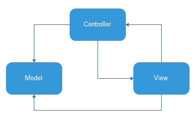
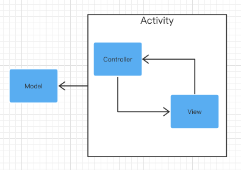
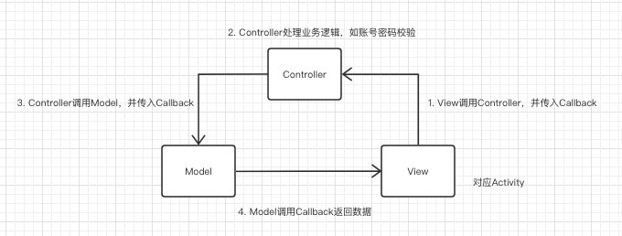
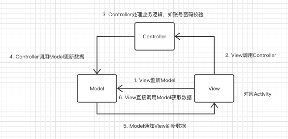
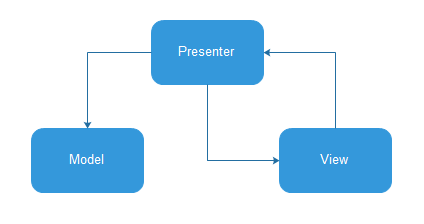
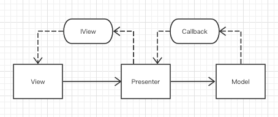
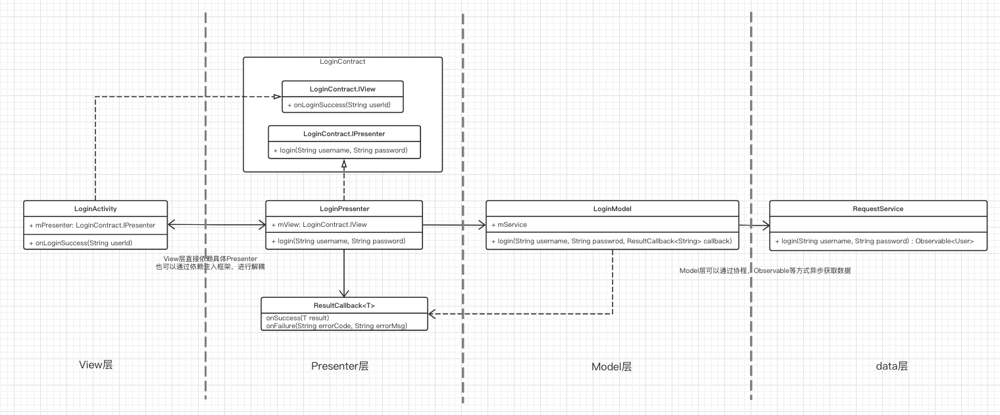

# MVC

## MVC基础



> Tips：箭头可以理解为引用、依赖，也可以理解为调用，因为引用了必然要调用。
>
> 有的MVC模式图包含了虚线和实线：虚线一般表现为临时变量，参数回调，实线表现为成员变量

1. Model：数据模型，负责数据获取、修改。代码中表现为Model、Repository（对数据进行隔离）、Service（访问网络）、Dao（访问数据库）、Entity等。
2. View：视图，负责视图显示和视图控制。代码中表现为Layout+Activity，如findViewById，setText、动画等。
3. Controller：控制器，负责所有的行为逻辑。代码中表现为Activity+各种管理类，如网络请求、SP存储、数据库访问、电量信息、网络状态等。除了对Model的调用外，还包含一些逻辑处理，如调用登录接口之前，对账号密码进行合法校验，加密等。

样例代码：

```kotlin
class LoginActivity {
    private val mModel = LoginModel()

    fun onClick() {
      	//账号密码校验、加密等逻辑
        mModel.login("username", "password", object : ResultCallback<String?> {
            override fun onSuccess(result: String?) {
                //回调方式返回数据
                onLogin(result)
                //View直接从Model层获取数据显示
                //setText(mModel.user)
            }

            override fun onFailure(errorCode: String?, errorMsg: String?) {}
        })
    }

    fun onLogin(name: String?) {
        //runOnUIThread...
    }
}

class LoginModel {
    var user: String? = null

    fun login(username: String?, password: String?, callback: ResultCallback<String?>) {
        //runOnIOThread...
      	//Controller
        callback.onSuccess("Afauria")
    }
}

interface ResultCallback<T> {
    fun onSuccess(result: T)
    fun onFailure(errorCode: String?, errorMsg: String?)
}
```

## 提问

### 何为Model？

> Model指数据模型。
>
> * 狭义的Model指API接口、数据库、文件存储等数据。
> * 广义的Model不止是业务数据对象，还包含外部对象，如定位信息、网络状态、电量等。这些都属于Model层数据交互部分。
>
> 因此，在狭义上讲，可以把电量管理、定位管理、网络管理等认为是Controller，命名可能叫`LocationManager`、`NetwrokHelper`、`BatteryManager`...
>
> 在MVC中，View需要对接各种管理器。
>
> 在MVP中，View只关心自己的Presenter，由Presenter对接不同的Model。

### 何为Controller？

* 狭义的Controller：即Controller类
* 广义的Controller：Controller不具体指哪一个类，而是指逻辑行为代码，可能是一个类（有的时候命名为Controller、Helper、Manager）、可能是一个方法或者代码块。

### 怎么理解View和Model关联？

Android MVC中Activity既包含了视图、又包含了逻辑，View和Controller没有分离。

* 站在Activity类的角度讲，可以说View和Model有交互，也可以说Controller和Model有交互。
* 站在代码逻辑上讲，调用Model方法本身也是行为逻辑，因此和Model交互的永远是Controller，不会是View。

将MVC原本的图改为下图，实际是M<->V/C：



注：**这里的MVC不是标准的MVC模式，严格来说只能算M<->V/C**。在传统Web开发中，Model、Controller、View（JSP）是分离的。

## MVC的其他理解

网上有很多MVC的关系图，箭头关系表示都不一样，到底哪种是正确的呢？

1. 将Activity中逻辑处理部分抽到Controller中，避免Activity包含逻辑处理，并转发Callback。

代码见[MVCSample1]()



2. 将Activity中逻辑处理部分抽到Controller中，View可以直接调用Model获取数据

代码见[MVCSample2]()



View调用Model获取数据，包括直接获取、回调获取，此时Activity既是View，又包含了一部分Controller的逻辑，和Model层直接交互

## 总结

1. MVC有多种理解和实现，核心的点在于将代码划分为Model、View、Controller三个部分，至于三个部分怎么通信耦合、Activity究竟是属于View还是Controller没有严格规定。
2. 我们一直在说“Activity既包含了视图逻辑，又包含了业务逻辑，导致臃肿”。实际上这只是MVC的其中一种理解，上述两种实现，即使把业务逻辑抽出去，创建一个Controller类，但实际上还是MVC。

# MVP

## MVP基础



除了Model之外，Presenter还和其他外部对象交互，只需要保证View不包含逻辑代码




以登录业务为例，MVP类图如下



样例代码：

```kotlin
//1. 定义Contract接口
interface LoginContract {
    interface IView {
        fun onLogin(name: String?)
    }

    interface IPresenter {
        fun login(username: String?, password: String?)
    }
}

//2. Activity、Fragment实现IView接口
class LoginActivity : LoginContract.IView {
    var mPresenter: LoginContract.IPresenter = LoginPresenter(this)

    fun onClick() {
        mPresenter.login("username", "password")
    }

    override fun onLogin(name: String?) {
        //runOnUIThread...
    }
}

//3. Presenter实现IPresenter接口
class LoginPresenter(private val mView: LoginContract.IView) : LoginContract.IPresenter {
    private val mModel = LoginModel()
    override fun login(username: String?, password: String?) {
        mModel.login(username, password, object : ResultCallback<String?> {
            override fun onSuccess(result: String?) {
                mView.onLogin(result)
            }

            override fun onFailure(errorCode: String?, errorMsg: String?) {}
        })
    }
}

interface ResultCallback<T> {
    fun onSuccess(result: T)
    fun onFailure(errorCode: String?, errorMsg: String?)
}

class LoginModel {
    fun login(username: String?, password: String?, callback: ResultCallback<String?>) {
        //runOnIOThread...
        callback.onSuccess("Afauria")
    }
}
```


## MVP改造

1. 重复代码、公共接口：使用基类+泛型抽取公共接口和实现
   1. BasePresenter绑定和释放View、SafeHandler创建和释放等
   2. BaseView公共进度条、弹窗、getContext等
2. Presenter直接创建具体Model。
   1. 替换的时候需要修改Presenter类。
   2. 单元测试中，不方便mock Model。

> 可以通过依赖注入的方式进行解耦，变量初始化放到外部，可以随时替换，方便单元测试。
>
> 代码见[InjectMVP和InjectMVPTest]()

## 提问

### MVP如何定义接口？

最常见的MVP实现是P和V定义接口，Model不抽。

反过来问，Presenter、View、Model是否可以不定义接口？

> 可以抽，也可以不抽，看实际需要。不要为了抽接口而抽接口，明确抽接口的目的和意义。

### 抽接口和抽基类有什么区别？

> 抽接口目的
>
> 1. 实现多态：替换不同实现
> 2. 依赖倒置：Presenter修改实现，View不需要修改。View修改实现，Presenter不需要修改
> 3. 代码逻辑清晰，可读性强：都在Contract中
>
> 抽Base类是为了抽取公共逻辑，Base类是后续衍生出来的，不在架构模式定义中

### MVP中V层可以是Fragment吗？一个Activity有多个Fragment呢？

> 可以，每个Fragment实现不同的View接口，对应不同的Presenter。

### 如果两个Fragment需要用到一个Presenter中的数据该怎么做

1. 将Activity作为View，对应一个Presenter，Activity拿到数据之后调用Fragment更新
2. 两个Fragment分别对应两个Presenter，两个Presenter共用一个Model，都从Model中获取数据
3. 将该功能拆分出来：Activity中创建Presenter2对象，两个Fragment除了依赖自己的Presenter之外，再依赖一个共同的Presenter2

# MVC和MVP对比

### MVC->MVP?

有的人说MVC中Activity承担Controller的功能，MVP将Controller逻辑抽离出去，Activity只负责视图控制。那么

1. 把Activity中的逻辑处理抽出去，就是MVP了吗?

> 上面讲了几种MVC的实现，即使抽出了Controller，还是MVC

有的人会说MVP相比MVC需要定义接口

2. 把Activity中的逻辑处理抽出去，再定义View和Controller的接口，就是MVP了吗？

   > 反过来问，MVP中是否可以不定义View和Presenter接口？

有的人会说MVP中View和Model不能直接依赖

3. View层定义一个Callback，Controller定义一个Callback，避免View和Model直接耦合，就是MVP了吗

### MVP和MVC区别

1. MVP在MVC的基础上，增加了一些限定规则，使得代码更加的模版化、统一、一致。MVC可以有多种实现，没有太大约束，可以使用工具类、静态方法等抽取逻辑，不和View绑定。
2. Controller和Presenter作用不一样
   1. Presenter：展示器。Controller：控制器。
   2. Presenter决定页面的逻辑，包括显示逻辑、事件逻辑。Controller是基于行为的，不和页面绑定，负责处理事件行为。
   3. View和Presenter一般情况下是一对一。View和Controller是多对多，一个页面可以包含多个控制器，一个控制器可以被多个页面使用。
3. MVC做到了视图和数据的分离，MVP做到了视图和逻辑的分离，数据和视图的隔离

# MVVM

和MVC、MVP差异比较大，这里暂时不讲。

MVVM核心：数据驱动UI
